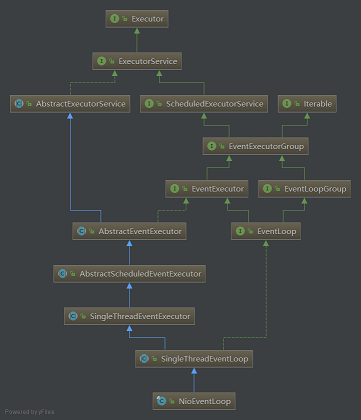
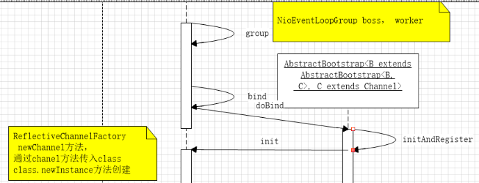
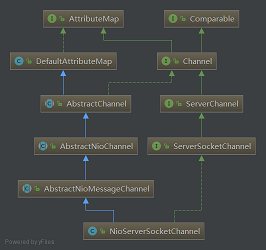

### facetoface源码解析
auth服务：负责登录认证  
#### 解析配置。common-cli-1.3.1.jar
```java
static void parseArgs(String[] args) throws ParseException {
        CommandLineParser parser = new BasicParser();
        Options options = new Options();
        options.addOption("h", "help", false, "Print this usage information");
        options.addOption("c", "cfg", true, "config Absolute Path");
        options.addOption("l", "log", true, "log configuration");

        // Parse the program arguments
        CommandLine commandLine = parser.parse(options, args);
}

#### 启动Worker处理消息IMHandler队列
```
获取auth认证服务器Worker线程启动个数，workNum
```java
    new Worker[workNum]; 
    for:worker = new Worker();
    worker.start()
```
Woker类中包含成员：
private final BlockingQueue<IMHandler> _tasks = new LinkedBlockingDeque<>();

run方法
```java
while(!_stop) {
    IMHandler handler = _tasks.poll(600, TimeUnit.MILLISECONDS);
    assert handler != null;
    handler._jedis = AuthStarter._redisPoolManager.getJedis();
    handler.excute(this);
}
```
[Jedis池优化](https://www.alibabacloud.com/help/zh/doc-detail/98726.htm)

#### 启动AuthServer
```java
 public static void startAuthServer(int port) {
        EventLoopGroup bossGroup = new NioEventLoopGroup();
        EventLoopGroup workGroup = new NioEventLoopGroup();

        /**
        *  初始化配置group,childGroup,channelFactory,childHandler
        *  options,childOptions
        */
        ServerBootstrap bootstrap = new ServerBootstrap()
                .group(bossGroup, workGroup)
                .channel(NioServerSocketChannel.class)
                .childHandler(new ChannelInitializer<SocketChannel>() {
                    @Override
                    protected void initChannel(SocketChannel channel)
                            throws Exception {
                        ChannelPipeline pipeline = channel.pipeline();
                        pipeline.addLast("MessageDecoder", new PacketDecoder());
                        pipeline.addLast("MessageEncoder", new PacketEncoder());

                        pipeline.addLast("AuthServerHandler", new AuthServerHandler());
                    }
                });

        bindConnectionOptions(bootstrap);

        bootstrap.bind(new InetSocketAddress(port)).addListener(new ChannelFutureListener() {
            @Override
            public void operationComplete(ChannelFuture future)
                    throws Exception {
                if (future.isSuccess()) {
                    //init registry
                    ParseRegistryMap.initRegistry();
                    HandlerManager.initHandlers();
                    logger.info("[AuthServer] Started Successed, waiting for other server connect...");
                } else {
                    logger.error("[AuthServer] Started Failed");
                }
            }
        });
    }

    protected static void bindConnectionOptions(ServerBootstrap bootstrap) {

        bootstrap.option(ChannelOption.SO_BACKLOG, 1024);
        bootstrap.childOption(ChannelOption.SO_LINGER, 0);
        bootstrap.childOption(ChannelOption.TCP_NODELAY, true);

        bootstrap.childOption(ChannelOption.SO_REUSEADDR, true); //调试用
        bootstrap.childOption(ChannelOption.SO_KEEPALIVE, true); //心跳机制暂时使用TCP选项，之后再自己实现

    }

```
### NioEventLoopGroup

NioEventLoopGroup
* 默认线程个数cpu*2或者可以初始化时候指定
* 使用默认的selector
* 线程工厂类io.netty.util.concurrent.DefaultThreadFactory
> 工厂方法对newThread方法传参runable使用包装器模式,包装类为FastThreadLocalThread，每个run方法均在结束后调用 FastThreadLocal.removeAll();
> FastThreadLocalThread继承Thread，加入了成员变量InternalThreadLocalMap

FastThreadLocal.removeAll
> InternalThreadLocalMap.getIfSet
* 获取当前线程
* 如果是FastThreadLocalThread，则获取threadLocalMap
* 否则从某个类(UnpaddedInternalThreadLocalMap类)的静态成员变量ThreadLocal<InternalThreadLocalMap>获取InternalThreadLocalMap


### NioEventLoop




AbstractBootstrap.java  
initAndRegister方法  
首先实例化chanel,类型这里是基于http协议的nio类型的chanel,  
NioServerSocketChannel类加载时指定默认的selector(WindowsSelectorImpl),  
SelectorProvider.provider().openSelector();

无参构造函数新建一个socket,  
newSocket
* 里面新建了个管道new DefaultChannelPipeline(this)
* 设置为非阻塞 ch.configureBlocking(false);
* unsafe=new NioMessageUnsafe();


doBind绑定IP地址，首先初始化和注册，初始化包含chanel设置options,attrs
```java
// This method is invoked before channelRegistered() is triggered.  Give user handlers a chance to set up
        // the pipeline in its channelRegistered() implementation.
        channel.eventLoop().execute(new OneTimeTask() {
            @Override
            public void run() {
                if (regFuture.isSuccess()) {
                    channel.bind(localAddress, promise).addListener(ChannelFutureListener.CLOSE_ON_FAILURE);
                } else {
                    promise.setFailure(regFuture.cause());
                }
            }
        });
```



> linkedblockingdeque应用场景?  
> Jedis工具类代码  
> options LinkedHashMap多线程使用synchronized同步

### ByteBuf
readIndex  
writeIndex  
markedReadIndex  
markedWriteIndex 

